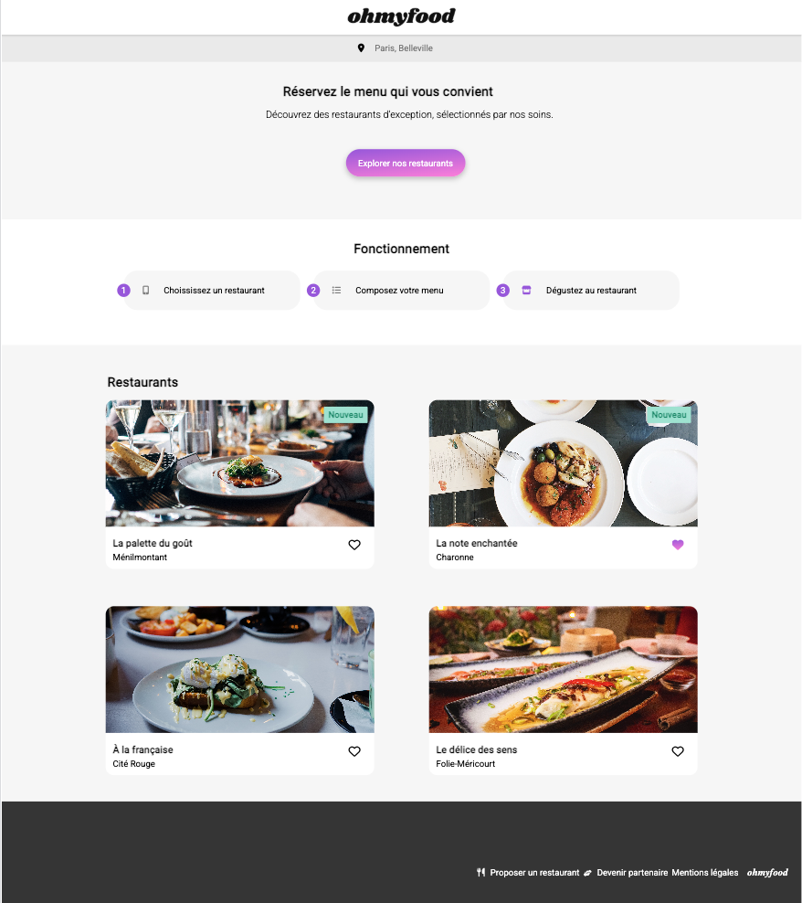
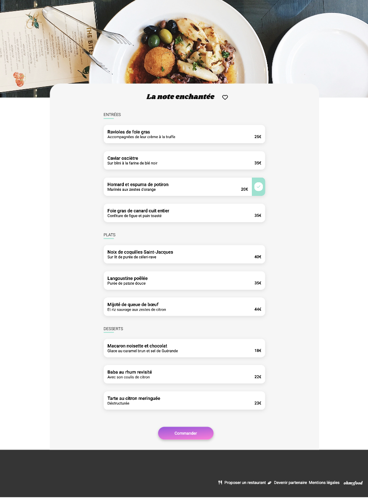
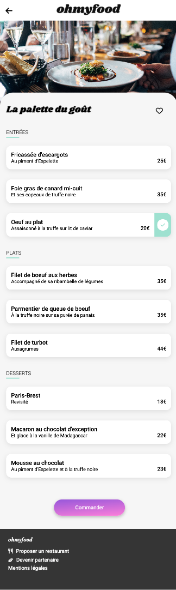
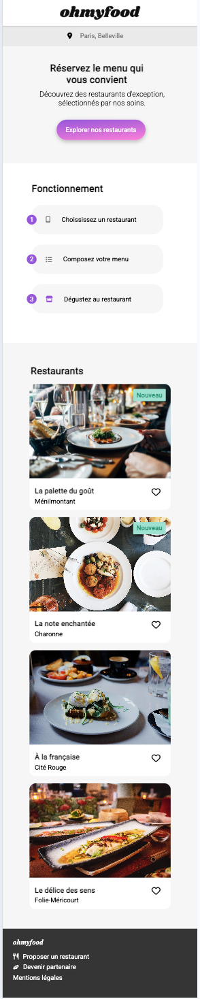

# OhMyFood — Interactive restaurant menu platform  

## 📸 Project Preview



OhMyFood is a redesign of the training project #3 of the **OpenClassrooms “Frontend Developer” path**.
It has been revisited and refined for learning and portfolio purposes.

> Original student author: **FanLubLou (Jacques Clermont)**  
> Project revisited and maintained by the same author.

---

## 🌍 Live Demo
👉 https://ohmyfoodjacquesdev.netlify.app/

[](https://app.netlify.com/projects/ohmyfoodjacquesdev/deploys)


---

## 🎯 Project Objectives

The objective of OhMyFood is to develop a responsive restaurant booking platform  
that allows users to explore restaurant menus interactively with smooth visual transitions.

This project was an opportunity to:

- Improve HTML semantic structure
- Master Sass architecture and component-based styling
- Work with animations, transitions and keyframes
- Practice code structure, readability and maintainability

---

## ✨ Features

### ✔ Responsive design  
A mobile-first interface that adapts gracefully to:

- small screens (mobile phones)
- medium screens (tablets)
- large desktop displays

### ✔ Restaurant menu navigation  
The application provides access to four restaurant pages, each presenting:

- a hero image
- the restaurant name
- starters, main dishes and desserts

### ✔ Smooth menu item interaction  
Menu cards feature:

- hover animations
- a green sliding validation indicator
- staggered fade-in reveal when the page loads

### ✔ Like (favorite) button effect  
Heart icons support:

- checked / unchecked visual states
- gradient hover animation
- checkbox-based logic (pure CSS / no JavaScript)

### ✔ Animated loader  
A minimal 3-dot animation displays during startup to reinforce perceived responsiveness.

### ✔ Design system  
Centralized styling via `settings.scss` includes:

- typography scale
- color variables
- state animations
- mixins for shared layouts

### ✔ Clean structure using Sass  
The project uses Sass partials to separate:

- global rules (`settings.scss`)
- homepage layout (`home.scss`)
- restaurant pages (`Menu.scss`)

The compiled output is stored in `style.css` for browser delivery.

---

## 🛠 Tech Stack

- **HTML5**
- **Sass / SCSS**
- **CSS Flex & Grid Layout**
- **Font Awesome**
- **Google Fonts**

## 🧱 Project Structure

```
/
├── assets
│   ├── images
│   └── style
│       ├── settings.scss
│       ├── home.scss
│       ├── Menu.scss
│       ├── style.css
│       └── style.css.map
├── docs
│   └── screenshots
│       ├── OhMyFood-home-desktop.png
│       ├── OhMyFood-home-mobile.png
│       └── OhMyFood-menu-desktop.png
│       └── OhMyFood-menu-mobile.png
├── index.html
├── readme.md
└── restaurants
    ├── Menu_A-la-francaise.html
    ├── Menu_La-note-enchantée.html
    ├── Menu_La-palette-du-gout.html
    └── Menu_Le-delice-des-sens.html
```
## 🧩 Layout & CSS Architecture

The project follows a modular Sass structure inspired by component-based thinking.

### Global Layout Principles

- **Mobile-first design**  
  The visual hierarchy and spacing are built from small devices upward.

- **Flexible containers using Flexbox and CSS Grid**  
  Used to organize restaurant cards, menu sections, headers and interactive zones.

- **Spacing consistency**  
  Gaps, padding and alignment rules are centralized to maintain visual rhythm.

### Sass Architecture Overview

The `/assets/style` folder contains three logical layers:

#### 🔹 `settings.scss` — Design System  
Defines global foundations including:

- color variables
- typography settings
- icon behavior
- shared mixins (such as `menu-card`)

This file acts as a **single source of truth** for UI identity.

#### 🔹 `home.scss` — Homepage layout & components  
Handles:

- loader animation
- header section
- location input area
- “How it works” cards
- restaurant listing and heart animation
- footer styling

#### 🔹 `Menu.scss` — Restaurant pages styling  
Responsible for:

- banner image positioning
- restaurant title & like button formatting
- menu panel layout
- delegation to shared mixins (`menu-card`)

This approach avoids duplication and ensures consistency across all pages.

### Output Layer

All Sass sources compile into:

- `style.css`
- `style.css.map`

These files are consumed directly by the browser.

This structure keeps the project simple while supporting scalability and readability for future improvements or refactoring.


## 📸 Screenshots

| Menu-desktop | Menu-mobile | Home-mobile |
|--------|---------|--------|
|  |  |  |


## 🚀 Getting Started

### Clone
```
git clone https://github.com/Jacques-Clermont-Dev/oc-p03-OhMyFood.git
```

### Open
Open folder in VS Code and launch using Live Server.

### Compile Sass
```
sass assets/style/style.scss assets/style/style.css
```


## 🔮 Possible Improvements

- Replace `@import` with `@use`
- Improve accessibility
- Modularize SCSS
- Templates for restaurant pages

## 👤 Author

Originally submitted under alias **FanLubLou**, actual developer:

**Jacques Clermont** — Front-End Developer

## 📜 License

Educational and portfolio purpose only.
